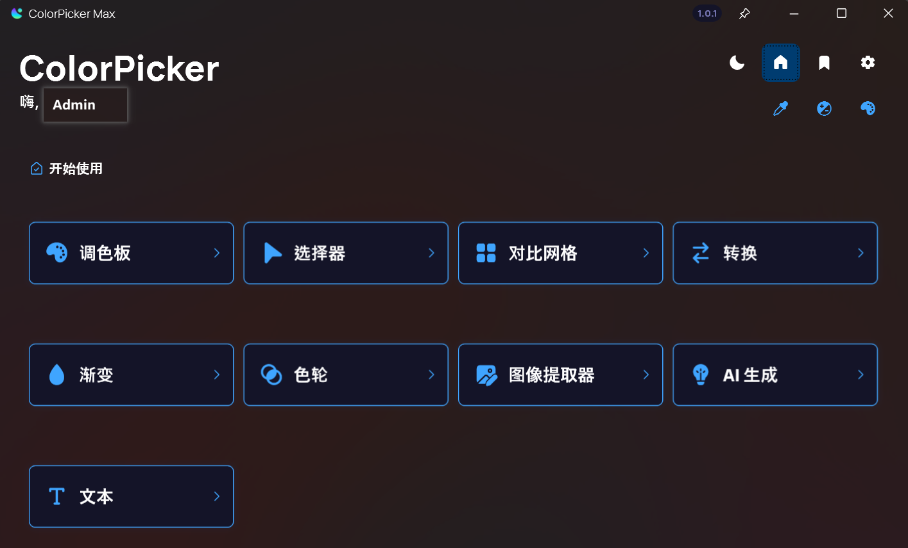
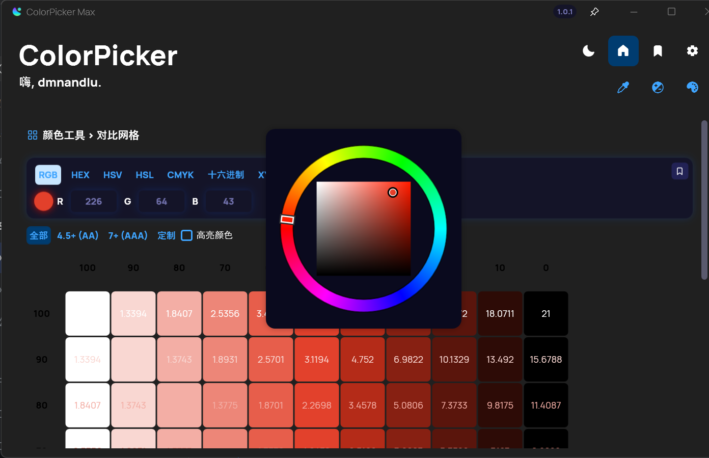
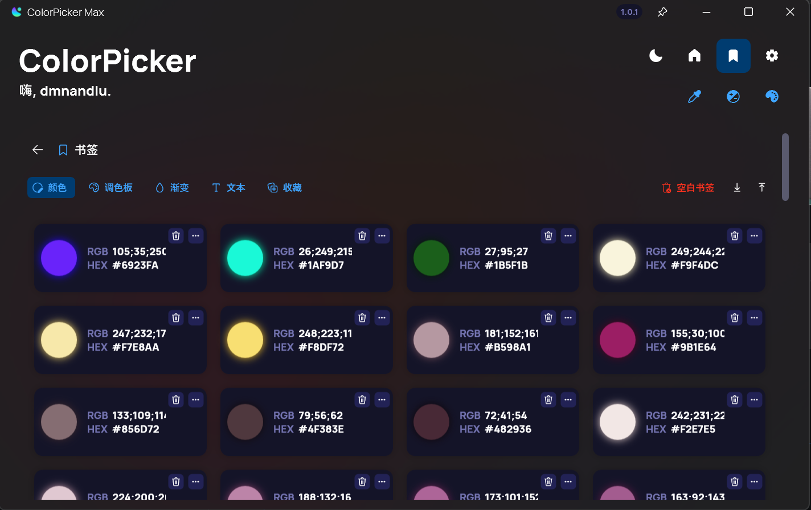
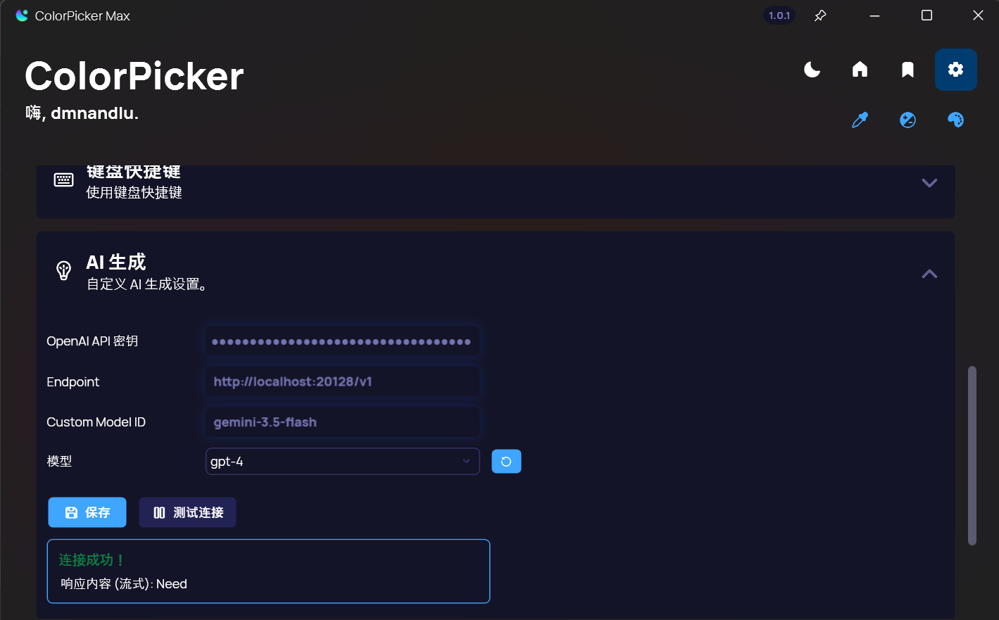

  

  <h1 align="center">ColorPicker Max</h1>

  

    A fork of Leo-Corporation/ColorPicker, featuring UI navigation overhaul, integrated color wheel, and custom AI settings.
     
    <a href="https://github.com/luzwales/ColorPicker/releases/latest"><strong>Download »</strong></a>
     
    <a href="https://github.com/luzwales/ColorPicker/issues">Report Bug</a>
  

## About This Fork
**ColorPicker Max** is an enhanced version of the original ColorPicker, designed for better workflow efficiency and deeper creative control.

### Key Changes
- **Navigation Overhaul**: Refactored the UI with a clean navigation sidebar for faster tool switching (导航栏重构).
- **Integrated Color Wheel**: Integrated PixiEditor's `SquarePicker` for interactive chromatic exploration (集成色轮控件).
- **Custom AI Settings**: Added specialized settings for AI color generation prompts (自定义 AI 设定).
- **Optimized Bookmarks**: Rebuilt bookmark performance with async caching (书签性能优化).

---

## Features

### Color Selection and Management
<picture>
  <source srcset="img/1.png" media="(prefers-color-scheme: dark)" />
  
</picture>

(Full original feature list remains, showcasing pickers, formats, and real-time conversion.)

### Chromatic Wheel (色轮控件)
<picture>
    
</picture>

Exploit an interactive wheel directly within the app, powered by PixiEditor.

### Text Tool & Accessibility
### Palette Generator
<picture>
    
</picture>
### Gradient Creator
<picture>
    
</picture>
### AI Color Suggestions (自定义 AI 设定)
<picture>
    
</picture>
Leverage AI for natural language color generation. Customize the prompt behavior in the new AI Settings panel.

### Bookmarks (书签)
Save assets with optimized performance.

## Contribute
To build this fork:

-   **Visual Studio 2022** (v17.0+)
-   **.NET 10 SDK**
-   (_Optional_) **Inno Setup** v6.1+

👉 [See full contribution guide](https://github.com/Leo-Corporation/ColorPicker/blob/main/CONTRIBUTING.md)

## License
MIT
